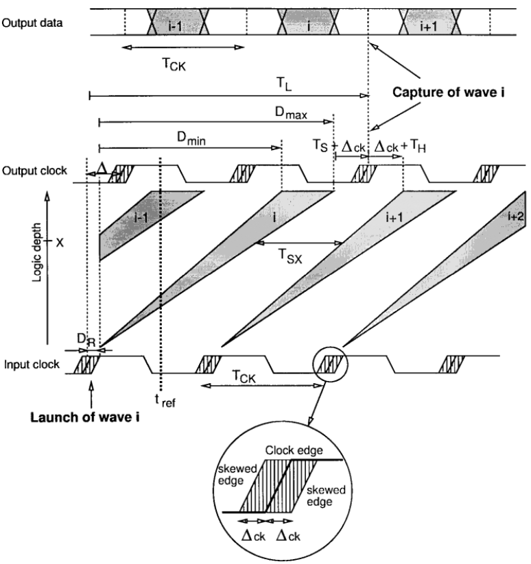
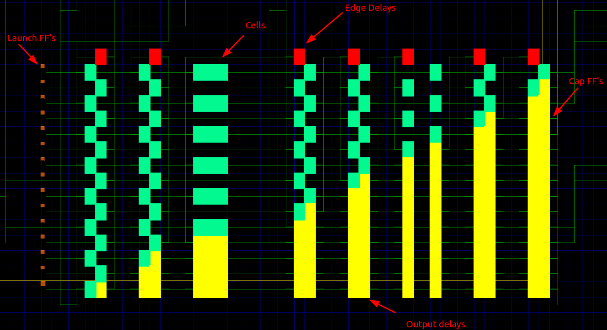

# The Wave Pipeline Effect

## What is Wave Pipelining?
Wave Pipelining is a high-performance digital design technique which implements pipelining in combinational logic without the use of intermediate latches or registers. This is achieved by applying new data to the input of a combinational logic block before the output of the previous input is available, effectively using the combinational logic as "virtual" register stages. 

## This Project
This project aims to explore implementing wave pipeline design techniques in FPGAs. Building wave pipelines is based on the equalization of all combinational delay paths. FPGAs offer reconfigurability and well-characterized component delay models, this makes FPGAs an ideal platform for economically exploring WP design techniques.

## Why?
Building wave pipelines requires deep technical knowledge and presents many learning opportunities. Traditional FPGA synthesis and P&R flows are not designed for wave pipelining. The job of design, delay path equalization, placement, routing, and timing analysis all fall to the designer. The designer must be intimately familiar with their digital design fundamentals, EDA tooling, and specific FPGA architecture.

## Current State

Currently this repo houses a two stage wave pipelined multiplier implemented on a Artix-7 FPGA. 

This WP is a re-implementation of this [paper](https://citeseerx.ist.psu.edu/document?repid=rep1&type=pdf&doi=d2740cc11f0429aef668d336bf89764a6949a5fe) on a modern FPGA. 

## Future plans

The goal for this project is to provide resources for learning about wave pipelining and potentially developing EDA tooling for building WP's in FPGAs. 

## Wave Pipeline Resources

[Overview of the topic](https://www.cs.princeton.edu/courses/archive/fall01/cs597a/wave.pdf)

[Eduardo I. Boemo, Sergio Lopez-Buedo, and Juan M. Meneses](https://citeseerx.ist.psu.edu/document?repid=rep1&type=pdf&doi=d2740cc11f0429aef668d336bf89764a6949a5fe)